# GemQuest - Planificacion, gestion agil y modelado

Este archivo es el documento vivo del proyecto GemQuest. Consolida el contenido del documento Word `Planificacion_Gestion_Agil_GemQuest.docx`, el Markdown del Entregable 1 y las actualizaciones realizadas en el MVP funcional.

Cada cambio relevante del producto debe reflejarse aqui: historias, alcance, reglas, diagramas, modelo de dominio, estados, evidencias y trazabilidad con el codigo.

## Datos del documento base

| Campo | Valor |
| --- | --- |
| Facultad | Facultad de Ciencias de la Vida y Tecnologias |
| Tema | Proyecto Final - GemQuest |
| Profesor | Ing. Israel Julio Gomez Calderon |
| Materia | Modelado Agil de Software |
| Fecha del documento base | 01 de julio del 2026 |

### Integrantes

- Jose Luis Sarabia Calderon
- Sebastian Esteban Alvarez De la Rosa
- Romero Ponce Jostin Paul
- Adriel Elias Sanchez Zaldumbide
- Jordy Sebastian Bravo Veliz

## Estado actual del MVP

El MVP implementado corresponde a la opcion B: juego casual tipo Match-3. La solucion esta construida como aplicacion web estatica con HTML, CSS y JavaScript modular.

| Area | Estado actual |
| --- | --- |
| Tablero Match-3 | Implementado |
| Intercambio de fichas adyacentes | Implementado |
| Deteccion de combinaciones 3+ | Implementado |
| Eliminacion, cascadas, gravedad y recarga | Implementado |
| Puntuacion y movimientos limitados | Implementado |
| Tres niveles con objetivos distintos | Implementado |
| Persistencia de progreso | Implementado con `localStorage` |
| Mejor puntuacion por nivel | Implementado con `localStorage` |
| Pantallas de inicio, niveles y resultado | Implementadas |
| Retroalimentacion visual y sonido | Implementacion basica |
| Pruebas automatizadas | Implementadas con `node --test` |
| CI/CD | Pipeline basico en GitHub Actions |
| Contenedorizacion | `Dockerfile` incluido |

# 1. Planificacion y gestion agil

## 1.1 Metodologia agil seleccionada

Para el desarrollo de **GemQuest** se selecciono **Scrum** como metodologia agil, debido a que permite organizar el trabajo mediante iteraciones cortas, entregas incrementales y adaptacion continua ante cambios en los requisitos.

GemQuest es un juego web tipo **Match-3**, inspirado en mecanicas similares a Candy Crush, donde el jugador intercambia gemas adyacentes para formar combinaciones de tres o mas elementos iguales. El proyecto se planifica como un **Producto Minimo Viable (MVP)** dividido en dos sprints.

### Roles Scrum

| Rol | Responsable | Funciones principales |
| --- | --- | --- |
| Product Owner | Equipo del proyecto | Define la vision del producto, prioriza el Product Backlog y valida que las historias cumplan los criterios de aceptacion. |
| Scrum Master | Equipo del proyecto | Facilita las ceremonias Scrum, da seguimiento al tablero y ayuda a resolver impedimentos. |
| Equipo de desarrollo | Integrantes del equipo | Disena, implementa, prueba e integra las funcionalidades del juego. |

## 1.2 Vision del producto

**GemQuest** permitira al jugador iniciar una partida, visualizar un tablero de gemas, intercambiar piezas, formar combinaciones, acumular puntos, completar objetivos por nivel y guardar su progreso.

El MVP incluye:

- Tablero funcional de gemas.
- Intercambio de fichas adyacentes.
- Deteccion y eliminacion de combinaciones.
- Sistema de gravedad y generacion de nuevas fichas.
- Tres niveles con objetivos definidos.
- Sistema de puntuacion y movimientos limitados.
- Persistencia basica del progreso.
- Interfaz clara para iniciar, jugar, ganar o perder una partida.

## 1.3 Product Backlog

El Product Backlog contiene las historias de usuario priorizadas para construir el MVP de GemQuest. Cada historia se relaciona con una epica, una prioridad MoSCoW y una estimacion de esfuerzo.

| ID | Nombre | Epica | Historia de usuario | Prioridad MoSCoW | Estimacion | Estado actual |
| --- | --- | --- | --- | --- | --- | --- |
| HU-01 | Generar tablero valido | EP-01 Gestion del tablero | Como jugador, quiero que el juego genere automaticamente un tablero valido para comenzar una partida inmediatamente. | Must | M | Implementado |
| HU-02 | Intercambiar fichas | EP-02 Mecanicas del juego | Como jugador, quiero intercambiar dos gemas adyacentes para intentar formar combinaciones. | Must | M | Implementado |
| HU-03 | Detectar combinaciones | EP-02 Mecanicas del juego | Como jugador, quiero que el juego detecte combinaciones de tres o mas gemas iguales para validar mis movimientos. | Must | L | Implementado |
| HU-04 | Eliminar combinaciones | EP-02 Mecanicas del juego | Como jugador, quiero que las combinaciones encontradas se eliminen del tablero para recibir puntos. | Must | M | Implementado |
| HU-05 | Aplicar gravedad | EP-01 Gestion del tablero | Como jugador, quiero que las gemas caigan automaticamente para ocupar los espacios vacios. | Must | L | Implementado |
| HU-06 | Generar nuevas fichas | EP-01 Gestion del tablero | Como jugador, quiero que aparezcan nuevas gemas para mantener el tablero completo. | Must | M | Implementado |
| HU-07 | Sistema de puntuacion | EP-03 Sistema de niveles | Como jugador, quiero obtener puntos por cada combinacion realizada para medir mi avance. | Must | S | Implementado |
| HU-08 | Movimientos limitados | EP-03 Sistema de niveles | Como jugador, quiero tener una cantidad limitada de movimientos para que el nivel represente un reto. | Must | S | Implementado |
| HU-09 | Objetivos por nivel | EP-03 Sistema de niveles | Como jugador, quiero objetivos diferentes por nivel para que cada partida tenga una meta clara. | Must | L | Implementado |
| HU-10 | Pantalla de inicio | EP-04 Interfaz de usuario | Como jugador, quiero una pantalla de inicio para acceder facilmente al juego. | Should | XS | Implementado |
| HU-11 | Seleccion de nivel | EP-04 Interfaz de usuario | Como jugador, quiero seleccionar el nivel que deseo jugar para continuar mi progreso. | Should | S | Implementado |
| HU-12 | Pantalla de victoria | EP-04 Interfaz de usuario | Como jugador, quiero ver una pantalla de victoria cuando cumpla el objetivo del nivel. | Should | XS | Implementado |
| HU-13 | Pantalla de derrota | EP-04 Interfaz de usuario | Como jugador, quiero ver una pantalla de derrota cuando se terminen mis movimientos sin cumplir el objetivo. | Should | XS | Implementado |
| HU-14 | Guardar progreso | EP-05 Persistencia | Como jugador, quiero guardar mi progreso para continuar desde el ultimo nivel desbloqueado. | Should | M | Implementado |
| HU-15 | Guardar record | EP-05 Persistencia | Como jugador, quiero guardar mi mejor puntuacion para intentar superar mi record. | Could | S | Implementado |
| HU-16 | Animaciones | EP-06 Experiencia de usuario | Como jugador, quiero animaciones al eliminar y caer gemas para que el juego se sienta mas dinamico. | Could | M | Basico |
| HU-17 | Sonidos | EP-06 Experiencia de usuario | Como jugador, quiero efectos de sonido para recibir retroalimentacion durante la partida. | Could | S | Implementado |

### Estimacion y priorizacion

La estimacion se realizo mediante **T-shirt sizing**, usando las tallas **XS, S, M, L y XL**. Esta tecnica se aplico de forma manual durante la planificacion del equipo, comparando la complejidad, esfuerzo e incertidumbre de cada historia de usuario.

La priorizacion se realizo con **MoSCoW**:

- **Must Have:** indispensable para el MVP.
- **Should Have:** importante, pero no bloquea la funcionalidad principal.
- **Could Have:** deseable si queda tiempo.
- **Won't Have:** fuera del alcance de esta entrega.

## 1.4 Criterios de aceptacion

| ID | Criterios de aceptacion |
| --- | --- |
| HU-01 | El tablero se genera al iniciar una partida. No existen combinaciones iniciales automaticas. Todas las celdas del tablero contienen una gema visible. |
| HU-02 | El jugador puede seleccionar dos gemas adyacentes. El intercambio solo se permite si las gemas estan una al lado de la otra. Si el movimiento no genera combinacion, las gemas regresan a su posicion original. |
| HU-03 | El sistema identifica combinaciones horizontales y verticales de tres o mas gemas iguales. Las combinaciones se detectan despues de cada movimiento valido. |
| HU-04 | Las gemas combinadas desaparecen del tablero. El sistema actualiza el puntaje despues de eliminar una combinacion. No se eliminan gemas que no formen parte de una combinacion. |
| HU-05 | Las gemas superiores caen para llenar los espacios vacios. La gravedad se aplica hasta que no queden huecos intermedios. El tablero mantiene su tamano original. |
| HU-06 | Se generan nuevas gemas en los espacios vacios de la parte superior. Las nuevas gemas se integran al tablero despues de aplicar gravedad. El tablero queda completo al finalizar la jugada. |
| HU-07 | El puntaje aumenta al eliminar combinaciones. Las combinaciones mas grandes otorgan mayor puntaje. El puntaje actual se muestra durante la partida. |
| HU-08 | Cada movimiento valido reduce en uno el contador de movimientos. El contador se muestra en pantalla. Cuando llega a cero, el juego evalua si el nivel fue ganado o perdido. |
| HU-09 | Cada nivel tiene un objetivo especifico. El juego valida automaticamente si el objetivo fue cumplido. Al cumplir el objetivo, se muestra la pantalla de victoria. |
| HU-10 | La pantalla de inicio muestra el nombre del juego. Incluye un boton para comenzar. El boton lleva al flujo principal del juego. |
| HU-11 | La pantalla de seleccion muestra los niveles disponibles. Los niveles bloqueados no pueden seleccionarse. El jugador puede iniciar un nivel desbloqueado. |
| HU-12 | La pantalla de victoria aparece al cumplir el objetivo. Muestra el puntaje obtenido. Permite avanzar o volver a la seleccion de nivel. |
| HU-13 | La pantalla de derrota aparece cuando se agotan los movimientos sin cumplir el objetivo. Permite reintentar el nivel. |
| HU-14 | El progreso se guarda al completar un nivel. Al volver al juego se conserva el ultimo nivel desbloqueado. El guardado funciona aunque se cierre el navegador. |
| HU-15 | El sistema guarda la mejor puntuacion obtenida. Si el jugador supera su record, el valor anterior se actualiza. El record se muestra en la interfaz. |
| HU-16 | Las gemas tienen animacion al desaparecer. La caida de nuevas gemas se visualiza de forma fluida. Las animaciones no impiden jugar correctamente. |
| HU-17 | El juego reproduce sonidos en acciones importantes. Los sonidos no se superponen de forma molesta. El jugador puede jugar aunque el sonido no este disponible. |

## 1.5 Priorizacion MoSCoW

| Categoria | Historias incluidas | Justificacion |
| --- | --- | --- |
| Must Have | HU-01, HU-02, HU-03, HU-04, HU-05, HU-06, HU-07, HU-08, HU-09 | Son necesarias para que el juego sea funcional y el MVP pueda completarse. |
| Should Have | HU-10, HU-11, HU-12, HU-13, HU-14 | Mejoran el flujo de usuario y permiten una experiencia completa, aunque la mecanica principal puede existir sin ellas. |
| Could Have | HU-15, HU-16, HU-17 | Aportan valor adicional y mejor experiencia, pero no son indispensables para la entrega inicial. |
| Won't Have | Tienda, sistema de vidas, ranking online, inicio de sesion | Se excluyen para mantener el alcance del MVP dentro del tiempo disponible. |

## 1.6 Planificacion de sprints

### Sprint 1: mecanica principal del juego

**Objetivo:** construir el nucleo jugable de GemQuest, permitiendo generar el tablero, mover gemas, detectar combinaciones y actualizar el tablero despues de cada jugada.

**Duracion estimada:** 1 semana.

| Historia | Actividades principales | Estado esperado | Estado actual |
| --- | --- | --- | --- |
| HU-01 | Crear estructura del tablero y generar gemas iniciales. | Terminado | Terminado |
| HU-02 | Implementar seleccion e intercambio de gemas adyacentes. | Terminado | Terminado |
| HU-03 | Programar deteccion de combinaciones horizontales y verticales. | Terminado | Terminado |
| HU-04 | Eliminar combinaciones detectadas y preparar actualizacion del tablero. | Terminado | Terminado |
| HU-05 | Implementar gravedad para llenar espacios vacios. | Terminado | Terminado |
| HU-06 | Generar nuevas gemas despues de aplicar gravedad. | Terminado | Terminado |

### Sprint 2: MVP completo e interfaz

**Objetivo:** completar las reglas del juego, niveles, pantallas principales, persistencia y mejoras de experiencia.

**Duracion estimada:** 1 semana.

| Historia | Actividades principales | Estado esperado en documento base | Estado actual |
| --- | --- | --- | --- |
| HU-07 | Implementar calculo y visualizacion de puntaje. | Terminado | Terminado |
| HU-08 | Agregar contador de movimientos limitados. | Terminado | Terminado |
| HU-09 | Definir objetivos por nivel y validacion de victoria. | Terminado | Terminado |
| HU-10 | Crear pantalla de inicio. | Terminado | Terminado |
| HU-11 | Crear seleccion de nivel. | Terminado | Terminado |
| HU-12 | Crear pantalla de victoria. | Terminado | Terminado |
| HU-13 | Crear pantalla de derrota. | Terminado | Terminado |
| HU-14 | Guardar progreso del jugador. | Terminado | Terminado |
| HU-15 | Guardar mejor puntuacion. | Pendiente o en progreso | Terminado |
| HU-16 | Agregar animaciones. | Pendiente o en progreso | Basico |
| HU-17 | Agregar sonidos. | Pendiente o en progreso | Terminado |

## 1.7 Ceremonias Scrum documentadas

### Sprint 1

| Ceremonia | Descripcion | Resultado |
| --- | --- | --- |
| Sprint Planning | Se reviso el Product Backlog y se seleccionaron las historias indispensables para construir la mecanica base del juego. | Se definio el objetivo del sprint y se asignaron HU-01 a HU-06. |
| Daily Scrum | Se reviso el avance de las tareas, los bloqueos y las actividades pendientes del tablero. | Se identifico como principal riesgo la deteccion correcta de combinaciones y la aplicacion de gravedad. |
| Sprint Review | Se presento un tablero funcional donde el jugador podia intercambiar gemas y generar combinaciones. | Se valido que la mecanica principal funcionaba como base del MVP. |
| Sprint Retrospective | Se analizaron los avances y dificultades del sprint. | Se acordo dividir las tareas complejas en subtareas mas pequenas y probar cada mecanica por separado. |

### Sprint 2

| Ceremonia | Descripcion | Resultado |
| --- | --- | --- |
| Sprint Planning | Se priorizaron las historias relacionadas con puntuacion, movimientos, niveles, pantallas y persistencia. | Se planificaron HU-07 a HU-17, dando mayor prioridad a HU-07, HU-08, HU-09 y HU-14. |
| Daily Scrum | Se dio seguimiento al avance de interfaz, reglas de niveles y guardado de progreso. | Se detecto que los objetivos por nivel requerian mayor esfuerzo del estimado inicialmente. |
| Sprint Review | Se presento el MVP con niveles, puntaje, movimientos, pantallas de resultado y guardado basico. | Se recibio retroalimentacion sobre mejorar la claridad de los objetivos por nivel. |
| Sprint Retrospective | Se reviso el cumplimiento del MVP y el manejo del cambio de requisito. | Se concluyo que la reestimacion permitio mantener controlado el alcance del sprint. |

## 1.8 Tablero de gestion en Trello

Para evidenciar la gestion agil se utilizara un tablero en **Trello**, ya que permite representar visualmente el flujo de trabajo mediante listas y tarjetas.

El tablero fue configurado como evidencia del proceso Scrum aplicado al proyecto. En el se representan las historias planificadas, las tareas en progreso, las tareas en revision, las historias finalizadas, los cambios gestionados y los elementos que quedan fuera del alcance del MVP.

**Enlace al tablero Trello:** <https://trello.com/b/Bn3M92L8/gemquest-gesti%C3%B3n>

### Listas recomendadas

Crear un tablero llamado **GemQuest - Gestion Agil** con las siguientes listas:

| Lista en Trello | Uso |
| --- | --- |
| Product Backlog | Todas las historias HU-01 a HU-17 antes de ser planificadas. |
| Sprint 1 | Historias seleccionadas para el primer sprint: HU-01 a HU-06. |
| Sprint 2 | Historias seleccionadas para el segundo sprint: HU-07 a HU-17. |
| En progreso | Tarjetas que se estan desarrollando. |
| En revision | Tarjetas terminadas que deben validarse con criterios de aceptacion. |
| Terminado | Historias completadas y validadas. |
| Cambios gestionados | Requisitos modificados, reestimaciones y decisiones tomadas. |

### Tarjetas que deben crearse

- HU-01 Generar tablero valido
- HU-02 Intercambiar fichas
- HU-03 Detectar combinaciones
- HU-04 Eliminar combinaciones
- HU-05 Aplicar gravedad
- HU-06 Generar nuevas fichas
- HU-07 Sistema de puntuacion
- HU-08 Movimientos limitados
- HU-09 Objetivos por nivel
- HU-10 Pantalla de inicio
- HU-11 Seleccion de nivel
- HU-12 Pantalla de victoria
- HU-13 Pantalla de derrota
- HU-14 Guardar progreso
- HU-15 Guardar record
- HU-16 Animaciones
- HU-17 Sonidos

### Informacion dentro de cada tarjeta

- Historia de usuario.
- Epica relacionada.
- Prioridad MoSCoW.
- Estimacion T-shirt.
- Criterios de aceptacion.
- Sprint asignado.
- Estado de avance.

### Etiquetas recomendadas

| Etiqueta | Color sugerido | Uso |
| --- | --- | --- |
| Must | Rojo | Historias indispensables del MVP. |
| Should | Amarillo | Historias importantes. |
| Could | Verde | Historias deseables. |
| Sprint 1 | Azul | Historias del primer sprint. |
| Sprint 2 | Morado | Historias del segundo sprint. |
| Cambio | Naranja | Requisitos modificados o reestimados. |

### Evidencia para el documento

Para cumplir con la evidencia solicitada, se deben insertar capturas de pantalla de:

- Vista general del tablero Trello.
- Tarjetas del Sprint 1.
- Tarjetas del Sprint 2.
- Una tarjeta abierta mostrando historia, criterios de aceptacion, prioridad y estimacion.
- Tarjeta o lista de **Cambios gestionados** mostrando la modificacion de HU-09.

### Evidencia visual extraida del Word

**Figura 1. Vista general del tablero Trello**

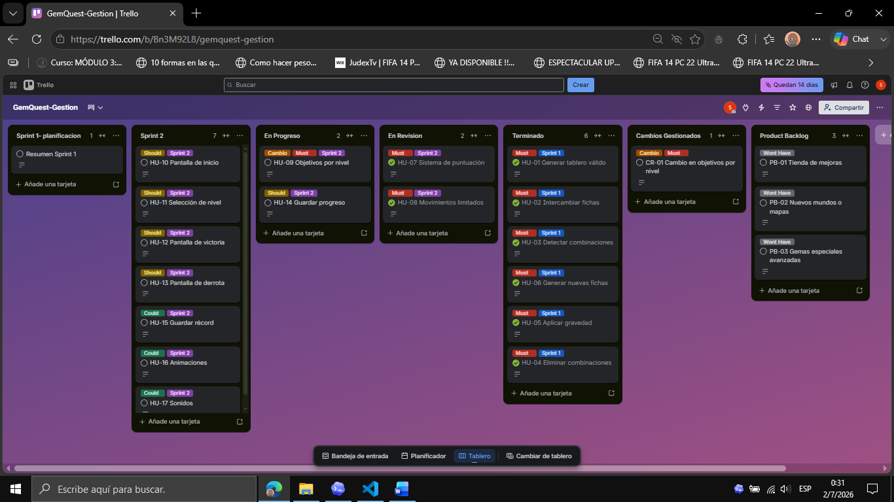

Esta captura evidencia la organizacion general del flujo de trabajo, la distribucion de historias por sprint y el estado actual de cada actividad.

**Figura 2. Historias completadas del Sprint 1**

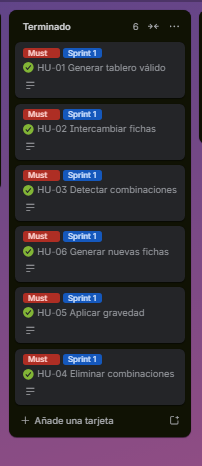

Esta captura evidencia que las historias correspondientes a la mecanica principal del juego fueron completadas al cierre del Sprint 1.

**Figura 3. Seguimiento del Sprint 2**

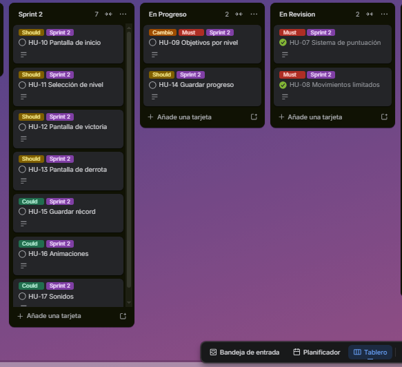

Esta captura evidencia que las historias del segundo sprint se encuentran distribuidas segun su estado: planificadas, en desarrollo o en revision.

**Figura 4. Detalle de historia de usuario**

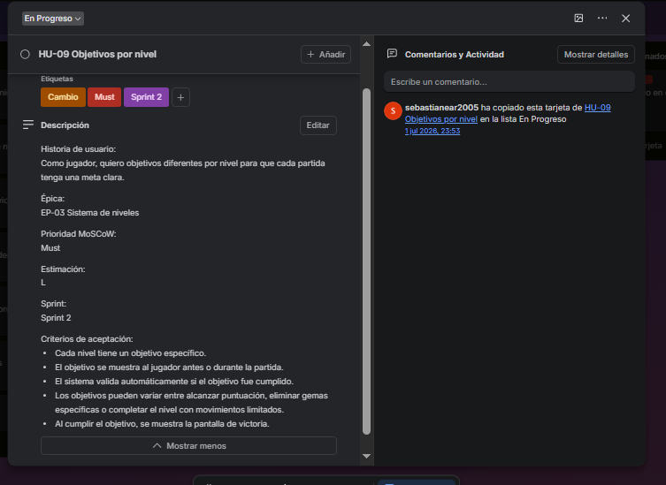

Esta captura evidencia que las historias de usuario fueron documentadas con informacion suficiente para su desarrollo y validacion.

**Figura 5. Cambio de requisito gestionado**

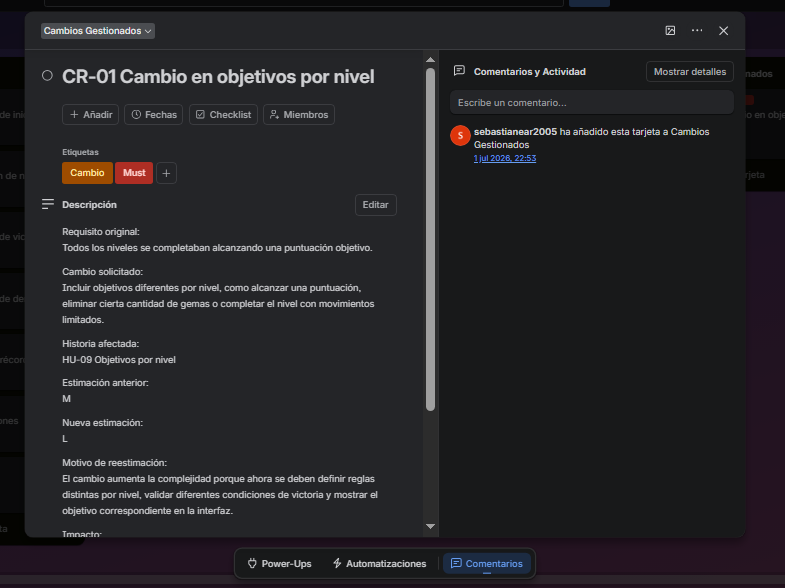

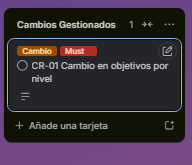

Esta captura evidencia que el cambio de requisito fue registrado, analizado y reestimado de M a L.

**Figura 6. Futuras mejoras del producto**

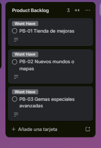

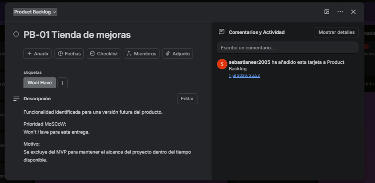

## 1.9 Gestion de cambio de requisito

Durante la planificacion inicial, los niveles de GemQuest se definieron con un unico tipo de objetivo: alcanzar una puntuacion minima. Posteriormente se identifico que esto podia volver repetitiva la experiencia de juego, por lo que se gestiono un cambio de requisito.

| Elemento | Descripcion |
| --- | --- |
| Requisito original | Todos los niveles se completaban alcanzando una puntuacion objetivo. |
| Cambio solicitado | Incluir objetivos diferentes por nivel, por ejemplo alcanzar cierta puntuacion, eliminar una cantidad especifica de gemas o completar el nivel con movimientos limitados. |
| Historia afectada | HU-09 Objetivos por nivel. |
| Estimacion inicial | M |
| Nueva estimacion | L |
| Motivo de reestimacion | El cambio aumenta la complejidad porque requiere definir reglas por nivel, validar condiciones de victoria distintas y mostrar objetivos claros en la interfaz. |
| Impacto en el sprint | La historia se mantiene en Sprint 2, pero se prioriza sobre animaciones y sonidos. |
| Decision tomada | Aceptar el cambio por aportar mas valor al MVP y mover HU-16/HU-17 como funcionalidades opcionales si el tiempo no alcanza. |

### Registro del cambio en Trello

En Trello se debe crear una tarjeta llamada **Cambio CR-01 - Objetivos por nivel** dentro de la lista **Cambios gestionados**.

Contenido sugerido de la tarjeta:

- **Descripcion:** se cambia el objetivo unico de puntuacion por objetivos variables segun el nivel.
- **Historia afectada:** HU-09.
- **Estimacion anterior:** M.
- **Estimacion nueva:** L.
- **Prioridad:** Must.
- **Impacto:** se prioriza HU-09 en Sprint 2 y se dejan animaciones/sonidos como Could Have.
- **Evidencia:** captura de la tarjeta en Trello.

## 1.10 Conclusiones de la planificacion agil

La planificacion agil de GemQuest permite organizar el desarrollo del MVP en dos sprints, priorizando primero la mecanica principal del juego y luego las funcionalidades de niveles, interfaz y persistencia. El uso de **T-shirt sizing** facilita una estimacion rapida del esfuerzo, mientras que **MoSCoW** permite distinguir las funcionalidades indispensables de las opcionales.

El tablero en Trello sirve como evidencia visual del avance del proyecto, la asignacion de historias por sprint y la gestion del cambio de requisito. La reestimacion de HU-09 demuestra que el equipo puede adaptarse a cambios sin perder control del alcance del proyecto.

# 2. Modelado agil

## 2.1 Story Mapping de las funcionalidades principales

El Story Mapping organiza las funcionalidades siguiendo el recorrido del jugador dentro del juego.

| Actividad del jugador | Funcionalidades (Historias de Usuario) |
| --- | --- |
| Ingresar al juego | HU-10 Pantalla de inicio |
| Seleccionar partida | HU-11 Seleccion de nivel |
| Comenzar partida | HU-01 Generar tablero valido |
| Jugar | HU-02 Intercambiar fichas |
| Resolver combinaciones | HU-03 Detectar combinaciones |
| Actualizar tablero | HU-04 Eliminar combinaciones, HU-05 Aplicar gravedad, HU-06 Generar nuevas fichas |
| Progreso de la partida | HU-07 Sistema de puntuacion, HU-08 Movimientos limitados, HU-09 Objetivos por nivel |
| Finalizar partida | HU-12 Pantalla de victoria, HU-13 Pantalla de derrota |
| Guardar progreso | HU-14 Guardar progreso, HU-15 Guardar record |
| Mejorar experiencia | HU-16 Animaciones, HU-17 Sonidos |

## 2.2 Arquitectura del sistema con modelo C4

El documento Word incluia diagramas generales de contexto y contenedores. En este Markdown se corrigen usando la notacion C4 de Mermaid:

- **Contexto C4:** muestra el sistema GemQuest y sus relaciones externas principales.
- **Contenedores C4:** muestra los contenedores ejecutables o desplegables y su responsabilidad.
- **Componentes:** se agrega para explicar la separacion entre capa de presentacion y logica del juego.

Nota de correccion: el Word mencionaba una "Base de datos". En el MVP implementado no existe backend ni base de datos externa; la persistencia real se hace mediante `localStorage` del navegador. Por eso los diagramas actualizados usan **LocalStorage** como almacenamiento.

### 2.2.1 Diagrama de Contexto C4

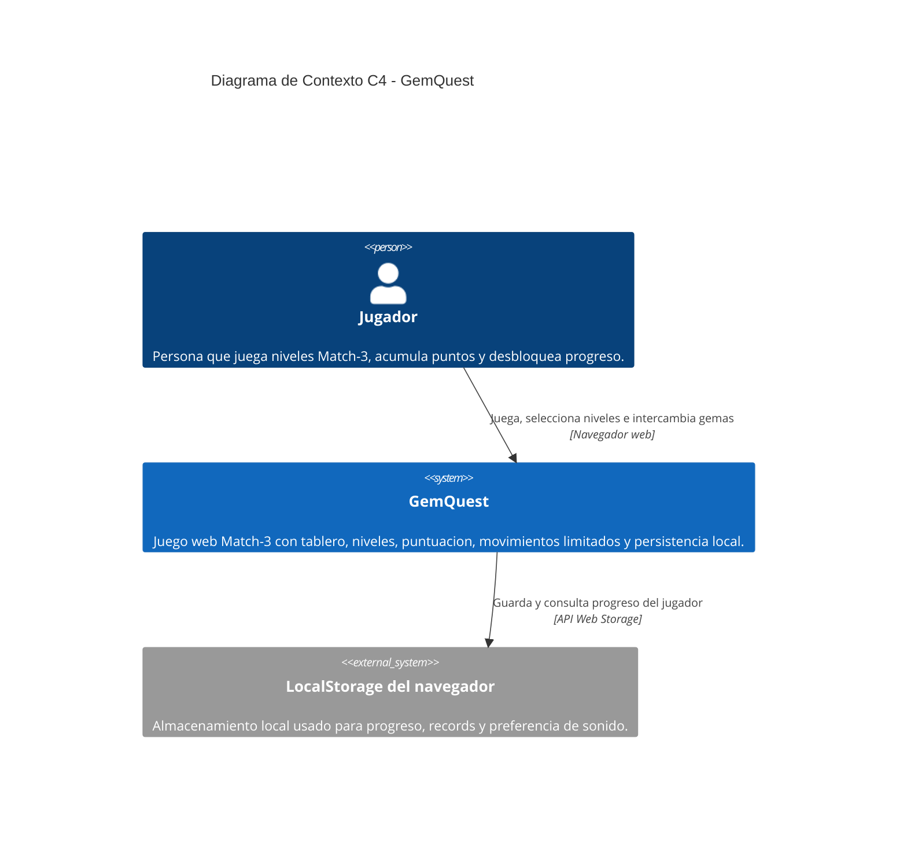

### 2.2.2 Diagrama de Contenedores C4

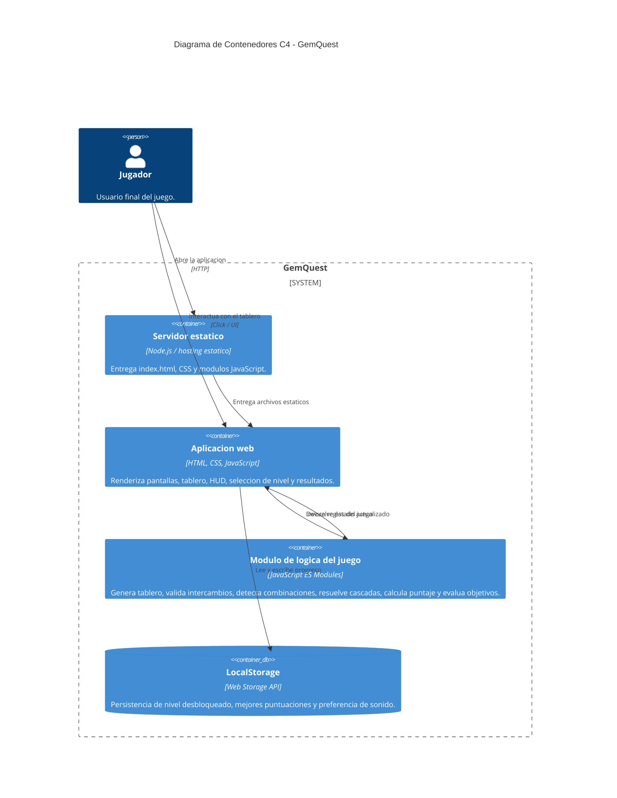

### 2.2.3 Vista de Componentes

Esta vista complementa C4 para mostrar la separacion interna mas importante del MVP: presentacion por un lado y reglas de juego por otro.

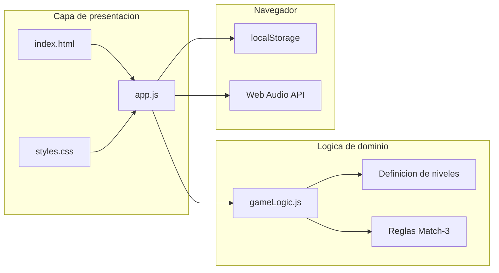

## 2.3 Modelo de Dominio

El modelo de dominio representa los conceptos centrales del juego: jugador, partida, tablero, celdas, gemas, objetivos, puntuacion y progreso.

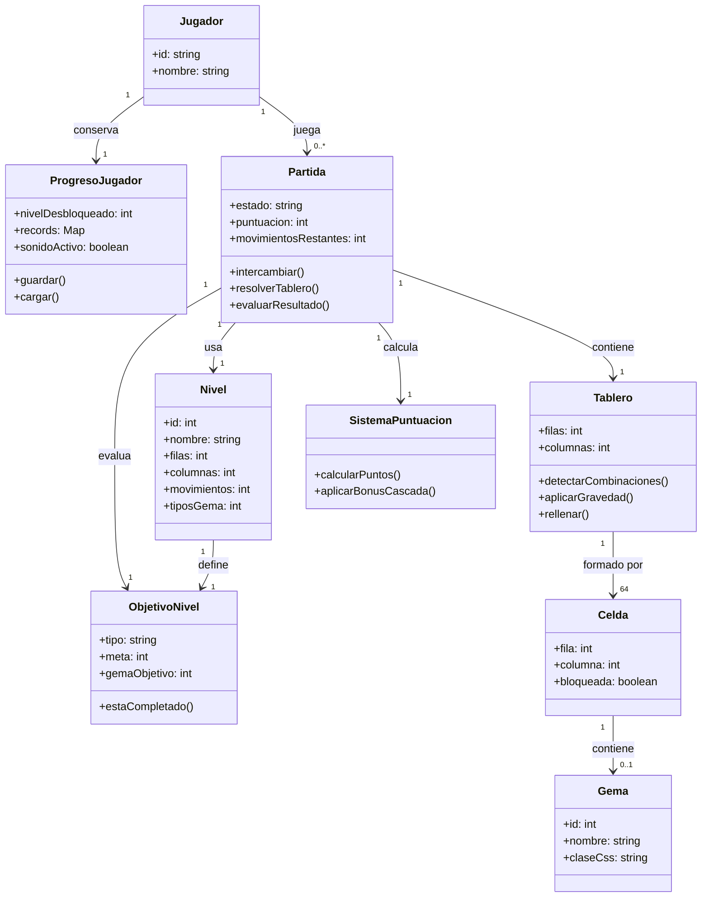

## 2.4 Maquina de estados del juego

La maquina de estados describe el flujo principal desde el inicio hasta la victoria o derrota.

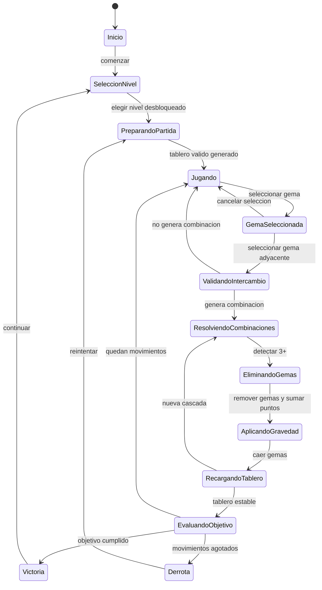

## 2.5 Modelado de la logica del tablero

La logica del tablero esta separada de la interfaz en `src/gameLogic.js`. Esto permite probar reglas sin depender del DOM.

### Reglas principales

| Regla | Descripcion | Historia relacionada |
| --- | --- | --- |
| Generacion valida | El tablero inicial se crea sin combinaciones automaticas. | HU-01 |
| Adyacencia | Solo se pueden intercambiar gemas vecinas en horizontal o vertical. | HU-02 |
| Reversion | Si el intercambio no forma combinacion, se revierte. | HU-02 |
| Deteccion | Se detectan grupos horizontales y verticales de 3 o mas gemas iguales. | HU-03 |
| Eliminacion | Las gemas combinadas se eliminan del tablero y suman puntos. | HU-04, HU-07 |
| Gravedad | Las gemas superiores caen para llenar espacios vacios. | HU-05 |
| Recarga | Se generan nuevas gemas en los espacios superiores. | HU-06 |
| Cascadas | Si despues de rellenar aparecen nuevas combinaciones, se resuelven automaticamente. | HU-03, HU-04, HU-05, HU-06 |
| Obstaculos | Las combinaciones adyacentes rompen obstaculos del nivel 3. | HU-09 |

### Flujo de resolucion de una jugada

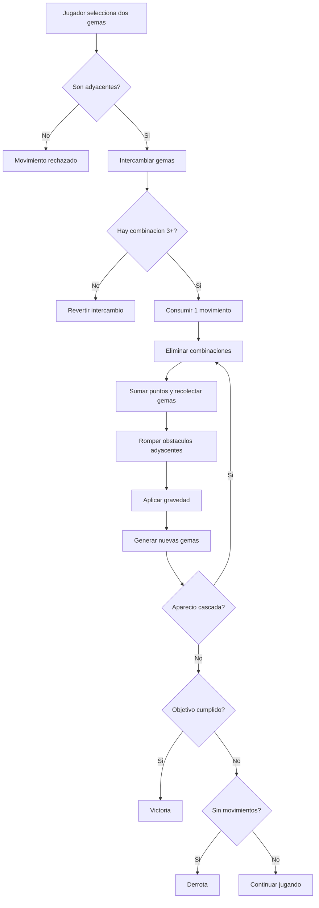

## 2.6 Niveles del MVP

| Nivel | Nombre | Objetivo | Movimientos | Dificultad |
| --- | --- | --- | --- | --- |
| 1 | Brillo inicial | Lograr 700 puntos | 22 | Base |
| 2 | Cosecha azul | Eliminar 18 gemas Zafiro | 24 | Media |
| 3 | Ruinas bloqueadas | Romper 8 obstaculos | 28 | Alta |

## 2.7 Trazabilidad entre historias y codigo

| Historia | Archivo principal | Evidencia tecnica |
| --- | --- | --- |
| HU-01 | `src/gameLogic.js` | `createBoard()` genera tablero completo sin combinaciones iniciales. |
| HU-02 | `src/gameLogic.js`, `src/app.js` | `applyMove()` valida adyacencia y `handleCellClick()` gestiona seleccion. |
| HU-03 | `src/gameLogic.js` | `findMatches()` detecta combinaciones horizontales y verticales. |
| HU-04 | `src/gameLogic.js` | `resolveBoard()` elimina gemas detectadas. |
| HU-05 | `src/gameLogic.js` | `applyGravityAndRefill()` aplica gravedad por columna. |
| HU-06 | `src/gameLogic.js` | `applyGravityAndRefill()` rellena espacios vacios. |
| HU-07 | `src/gameLogic.js`, `src/app.js` | `resolveBoard()` calcula puntos y la HUD los muestra. |
| HU-08 | `src/gameLogic.js`, `src/app.js` | `movesLeft` se reduce en movimientos validos y se muestra en pantalla. |
| HU-09 | `src/gameLogic.js` | `isObjectiveComplete()` evalua objetivos de puntaje, recoleccion y obstaculos. |
| HU-10 | `src/app.js` | `renderHome()` muestra pantalla inicial. |
| HU-11 | `src/app.js` | `renderLevels()` muestra niveles bloqueados/desbloqueados. |
| HU-12 | `src/app.js` | `renderResultBlock()` muestra victoria. |
| HU-13 | `src/app.js` | `renderResultBlock()` muestra derrota. |
| HU-14 | `src/app.js` | `loadProgress()` y `saveProgress()` guardan progreso. |
| HU-15 | `src/app.js` | `bestScores` guarda el record por nivel. |
| HU-16 | `src/styles.css` | Transiciones, seleccion visual, progreso y feedback de tablero. |
| HU-17 | `src/app.js` | `playTone()` genera sonidos basicos con Web Audio API. |

# 3. Integracion DevOps y ejecucion

## 3.1 Scripts principales

| Comando | Funcion |
| --- | --- |
| `npm start` | Levanta el servidor local estatico. |
| `npm run build` | Valida que los archivos estaticos existan y que los modulos carguen. |
| `npm test` | Ejecuta pruebas automatizadas de la logica del juego. |

## 3.2 Pipeline CI/CD

El archivo `.github/workflows/ci.yml` ejecuta:

- Validacion estatica con `npm run build`.
- Pruebas automatizadas con `npm test`.

## 3.3 Despliegue o contenedorizacion

El proyecto incluye un `Dockerfile` basico para ejecutar el MVP como aplicacion estatica servida por Node.js.

# 4. Bitacora de actualizaciones del documento vivo

| Cambio | Descripcion |
| --- | --- |
| Consolidacion del Word | Se incorporaron portada, integrantes, planificacion, backlog, criterios, sprints, ceremonias, Trello, cambio de requisito y modelado. |
| Evidencias visuales | Se extrajeron las capturas del `.docx` y se enlazaron desde `docs/assets/entregable-1-2/`. |
| Correccion C4 | Se reemplazaron diagramas generales por diagramas C4 de contexto y contenedores en Mermaid. |
| Modelo de dominio actualizado | Se ajusto el dominio a lo implementado: partida, nivel, objetivo, tablero, celda, gema, progreso y puntuacion. |
| Maquina de estados | Se documento el flujo completo de seleccion, intercambio, cascadas, victoria y derrota. |
| Trazabilidad | Se agrego una matriz HU -> archivo -> evidencia tecnica para conectar gestion agil con codigo. |
